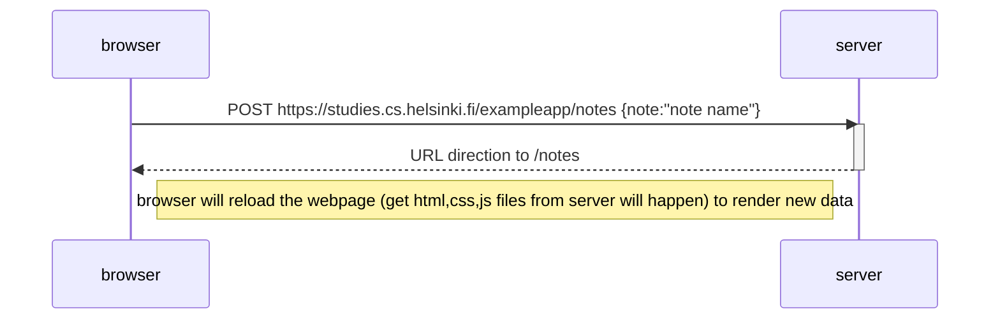

```mermaid
sequenceDiagram
    participant browser
    participant server

    browser->>server: POST https://studies.cs.helsinki.fi/exampleapp/notes {note:"note name"}
    activate server
    server-->>browser: URL direction to /notes
    deactivate server

    Note right of browser: browser will reload the webpage (get html,css,js files from server will happen) to render new data
```
