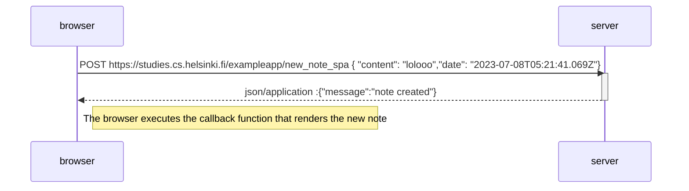

```mermaid
sequenceDiagram
    participant browser
    participant server

   browser->>server: POST https://studies.cs.helsinki.fi/exampleapp/new_note_spa {  "content": "lolooo","date": "2023-07-08T05:21:41.069Z"}
    activate server
    server-->>browser: json/application :{"message":"note created"}
    deactivate server

    Note right of browser: The browser executes the callback function that renders the new note
```
